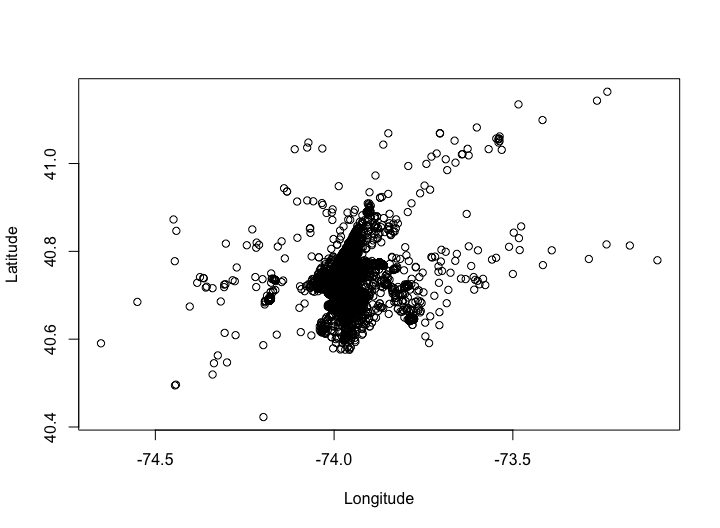

Lecture 1: Spatial Data Viz
================

## Data Viz Overview

Data visualization is an essential part of the statistical analysis
process, both for exploratory analyses and summarizing findings.

##### Exploratory Data Analysis

  - Used for data quality checks

  - Help explore and understand the data

  - Typically, not seen by anyone else

##### Polished Data Visualization

  - Used to summarize data in presentations or papers

  - Should *stand alone* with appropriate titles, axes, labels, and
    captions

  - `ggplot2` makes creating polished figures easier: [cheat
    sheet](https://www.rstudio.com/wp-content/uploads/2016/11/ggplot2-cheatsheet-2.1.pdf)

## Spatial Data Viz Tools

There are many tools for creating spatial figures (GIS software,
Tableau, etc…), but we will exclusively use R and the wide range of
packages within it.

In particular, some options include:

  - `ggplot2`

  - `ggmap`

  - `leaflet`

  - `RgoogleMaps`

  - `tmap`

  - and many
others…

## Point Data: What is this?



## Point Data: How about now?

## Active Learning Exercise: Seattle Police Calls Data Viz

``` r
seattle <- read_csv('SeattlePolice.csv')
```

    ## Parsed with column specification:
    ## cols(
    ##   CAD.Event.Number = col_double(),
    ##   Event.Clearance.Description = col_character(),
    ##   Event.Clearance.SubGroup = col_character(),
    ##   Event.Clearance.Group = col_character(),
    ##   Census.Tract = col_double(),
    ##   Longitude = col_double(),
    ##   Latitude = col_double(),
    ##   Year = col_double(),
    ##   Month = col_double(),
    ##   Day = col_double()
    ## )
